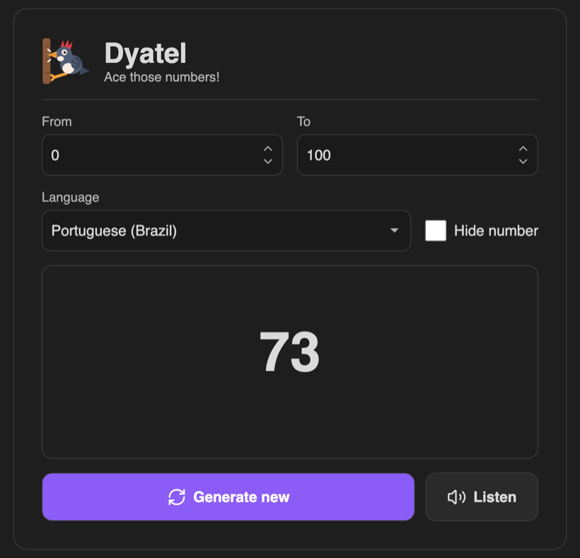
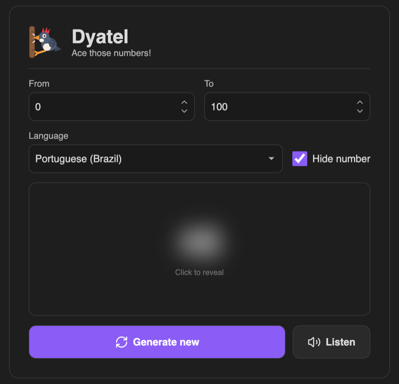

<div align="center">


# Dyatel

**Ace those numbers!**

An [Obsidian](https://obsidian.md) plugin for drilling numbers by ear —
generate a random number, hear it spoken in one of 15 languages, and check yourself.

</div>

---

Learning a language and still translating numbers in your head? Dyatel throws random
numbers at you, says them out loud, and keeps the answer hidden until you commit to a guess.

*Дятел* is Russian for **woodpecker** — a bird known for relentless, repetitive drilling.
Which is exactly how you learn numbers.

## Screenshots

| Generate and listen | Practise with the number hidden |
| --- | --- |
|  |  |

## Features

- **Random numbers in a range you choose** — defaults to 0–100, but set it to anything.
- **Hear it spoken** — press **Listen** and the number is read aloud in the selected language.
- **15 languages** — Portuguese (Brazil / Portugal), English (US / UK), Spanish, French,
  German, Italian, Dutch, Polish, Russian, Turkish, Japanese, Korean and Mandarin.
  Your choice is remembered between sessions.
- **Hide the number** — it blurs out so you can listen first and reveal the answer after.
  Click the blur to reveal.
- **Keyboard-driven** — drill without touching the mouse.

## Usage

Open the command palette and run **Open dyatel**.

| Key | Action |
| --- | --- |
| <kbd>Space</kbd> | Generate a new number |
| <kbd>S</kbd> | Speak the current number |
| <kbd>H</kbd> | Toggle **Hide number** |

Shortcuts are scoped to the Dyatel pane, so they never fire while you are writing notes,
and they are ignored while you are typing in the range fields.

A typical practice loop: tick **Hide number**, press <kbd>Space</kbd> for a fresh number,
<kbd>S</kbd> to hear it, say your answer out loud, then click the blur to check.

## Installation

### From a release

1. Download `dyatel-<version>.zip` from the [latest release](https://github.com/zavanton123/Dyatel/releases/latest).
2. Unzip it into your vault's `.obsidian/plugins/` folder, so you end up with `.obsidian/plugins/dyatel/`.
3. Reload Obsidian and enable **Dyatel** under **Settings → Community plugins**.

### Manual

Copy `main.js`, `manifest.json` and `styles.css` into `<vault>/.obsidian/plugins/dyatel/`.

## How the speech works

Dyatel asks Google Translate's text-to-speech endpoint for the audio, because its voices
are noticeably smoother than the ones bundled with most operating systems. The request goes
through Obsidian's `requestUrl`, so it is not subject to browser CORS rules.

The number is sent as a bare numeral — Google expands it into words in the target language
itself, which is why one language dropdown covers all 15 without a per-language spelling table.

If that endpoint cannot be reached — you are offline, or it rate-limits you — Dyatel falls
back to a locally installed system voice for the selected language and tells you it did so.
No API key is needed either way.

> **Note:** the Google endpoint is undocumented and could change without warning.
> The local-voice fallback exists so that the plugin degrades rather than breaks.

## Development

```bash
npm install
npm run dev     # watch build
npm run build   # type-check and produce a minified main.js
npm run package # build, then bundle the release zip
```

`npm run package` reads the version from `manifest.json` and writes
`dyatel-<version>.zip`, containing a `dyatel/` folder with `main.js`,
`manifest.json` and `styles.css` — ready to attach to a release or unzip
straight into `.obsidian/plugins/`.

To test in a real vault, copy `main.js`, `manifest.json` and `styles.css` into
`<vault>/.obsidian/plugins/dyatel/` and reload the plugin.

## Releasing

Pushing a tag that matches the version in `manifest.json` builds the plugin and
publishes the archive to a GitHub release automatically:

```bash
npm version 1.0.1 --no-git-tag-version   # bump manifest.json too
git commit -am "Release 1.0.1" && git tag 1.0.1 && git push --follow-tags
```

The [release workflow](.github/workflows/release.yml) refuses to publish if the
tag and `manifest.json` disagree, then attaches `dyatel-<version>.zip` along with
`main.js`, `manifest.json` and `styles.css`. It also runs when a release is
published from the GitHub UI, replacing the assets on the existing release.

## License

MIT
